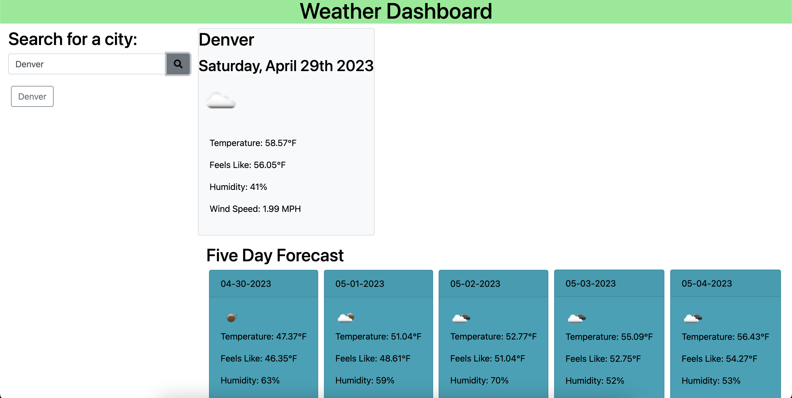

# Weather App

## Description

This app displays the up-to-date weather of a given city, plus a five-day forecast. It uses the Open Weather API to show data. It also allows the user to save different cities in local storage. My goal was to learn how server-side APIs can be used in applications and develop my HTML/CSS/JavaScript skills.

## Installation

Follow this link to access the application: https://github.com/jeremiahejensen04/My-Weather-Dashboard

## Usage

User can input a city in the search bar to access weather data from that city:

Save different cities to local storage:

## License
n/a
